# 🚀 Ultimate AI/ML/LLM Learning Hub

**The Most Comprehensive AI/ML/LLM Learning Resource on GitHub**

*Transform your journey from absolute beginner to AI expert with structured learning paths, hands-on projects, and a thriving community.*

[🎯 **Start Learning**](#-learning-paths) •
[📚 **Resources**](#-resources) •
[🛠️ **Projects**](#-hands-on-projects) •
[👥 **Community**](#-community) •
[🗺️ **Roadmaps**](#-career-roadmaps)

---

## 🌟 What Makes This Hub Special?

### 🎯 **Multi-Level Learning Tracks**
- 🌱 **Beginner Track** (0-6 months): Master AI/ML fundamentals
- 🔥 **Intermediate Track** (6-18 months): Deep learning & specialization  
- 🚀 **Advanced Track** (18+ months): Research & production systems
- 💎 **Expert Track**: Cutting-edge developments & novel architectures

### 🏗️ **Comprehensive Domain Coverage**
- **Machine Learning**: Supervised, unsupervised, reinforcement learning
- **Deep Learning**: Neural networks, CNNs, RNNs, Transformers
- **Large Language Models**: GPT, BERT, T5, fine-tuning, RLHF
- **Generative AI**: DALL-E, Stable Diffusion, GANs, VAEs
- **Computer Vision**: Object detection, image segmentation, OCR
- **Natural Language Processing**: Sentiment analysis, NER, translation
- **MLOps**: Model deployment, monitoring, CI/CD, production systems

### 🛠️ **Learn by Building**
- **50+ Hands-on Projects** across all skill levels
- **Real-world Datasets** and industry use cases
- **Portfolio-ready Solutions** with deployment guides
- **Performance Benchmarks** and optimization tips

---

## 🗺️ Learning Paths

```mermaid
graph TD
    A[🌱 Beginner Track<br/>0-6 months] --> B[🔥 Intermediate Track<br/>6-18 months]
    B --> C[🚀 Advanced Track<br/>18+ months]
    C --> D[💎 Expert Track<br/>Research & Innovation]
    
    A --> A1[Python & Math Foundations]
    A --> A2[ML Basics & Algorithms]
    A --> A3[Data Analysis & Visualization]
    
    B --> B1[Deep Learning Fundamentals]
    B --> B2[Specialized Domains]
    B --> B3[Project Development]
    
    C --> C1[Advanced Architectures]
    C --> C2[Production Systems]
    C --> C3[Research Papers]
    
    D --> D1[Novel Architectures]
    D --> D2[Distributed Training]
    D --> D3[Paper Implementation]
```

### 🌱 [Beginner Track](docs/learning-paths/beginner-track.md) - *Start Here!*
Perfect for those new to AI/ML with basic programming knowledge.

**📊 Prerequisites**: Basic Python, High School Math  
**⏱️ Duration**: 3-6 months (10-15 hrs/week)  
**🎯 Outcome**: Build your first ML models and understand core concepts

**Learning Path:**
1. **Foundations** → Python for Data Science, NumPy, Pandas
2. **Mathematics** → Linear Algebra, Statistics, Calculus basics
3. **Machine Learning** → Supervised learning, model evaluation
4. **Practice** → 5 beginner projects with real datasets

### 🔥 [Intermediate Track](docs/learning-paths/intermediate-track.md)
Dive deep into specialized domains and advanced techniques.

**📊 Prerequisites**: Completed Beginner Track or equivalent  
**⏱️ Duration**: 6-12 months (15-20 hrs/week)  
**🎯 Outcome**: Master deep learning and build production-ready systems

**Learning Path:**
1. **Deep Learning** → Neural networks, backpropagation, optimization
2. **Specialization** → Choose Computer Vision, NLP, or Reinforcement Learning
3. **Frameworks** → Master PyTorch/TensorFlow, deployment tools
4. **Projects** → 8 intermediate projects across different domains

### 🚀 [Advanced Track](docs/learning-paths/advanced-track.md)
Master cutting-edge techniques and production systems.

**📊 Prerequisites**: Completed Intermediate Track  
**⏱️ Duration**: 6-18 months (20+ hrs/week)  
**🎯 Outcome**: Research-level understanding and industry expertise

**Learning Path:**
1. **Advanced Architectures** → Transformers, attention mechanisms, novel designs
2. **MLOps & Production** → Deployment, monitoring, scalability
3. **Research Skills** → Paper reading, implementation, experimentation
4. **Capstone** → Original research project or production system

### 💎 [Expert Track](docs/learning-paths/expert-track.md)
Push the boundaries of AI research and innovation.

**📊 Prerequisites**: Advanced Track completion or PhD-level knowledge  
**⏱️ Duration**: Ongoing  
**🎯 Outcome**: Contribute to state-of-the-art research

---

## 🛠️ Hands-on Projects

### 🌱 Beginner Projects
| Project | Domain | Skills Learned | Duration |
|---------|--------|---------------|----------|
| [House Price Prediction](projects/beginner/linear-regression-house-prices/) | ML Basics | Linear regression, feature engineering | 1 week |
| [Movie Sentiment Analysis](projects/beginner/sentiment-analysis-tweets/) | NLP | Text processing, classification | 1 week |
| [Image Classification](projects/beginner/image-classification-cifar10/) | Computer Vision | CNNs, image preprocessing | 2 weeks |

### 🔥 Intermediate Projects
| Project | Domain | Skills Learned | Duration |
|---------|--------|---------------|----------|
| [AI Chatbot](projects/intermediate/chatbot-with-transformers/) | NLP | Transformers, dialogue systems | 3 weeks |
| [Object Detection](projects/intermediate/computer-vision-object-detection/) | Computer Vision | YOLO, R-CNN, real-time inference | 3 weeks |
| [Recommendation System](projects/intermediate/recommendation-system/) | ML Systems | Collaborative filtering, embeddings | 2 weeks |

### 🚀 Advanced Projects
| Project | Domain | Skills Learned | Duration |
|---------|--------|---------------|----------|
| [LLM Fine-tuning](projects/advanced/llm-fine-tuning/) | LLMs | Parameter-efficient fine-tuning, RLHF | 4 weeks |
| [GAN Image Generation](projects/advanced/gans-image-generation/) | Generative AI | GANs, diffusion models, synthesis | 4 weeks |
| [MLOps Pipeline](projects/advanced/mlops-pipeline/) | Production | CI/CD, monitoring, deployment | 3 weeks |

---

## 📚 Resources

### 📖 [Curated Books](resources/books/)
- **Beginner**: Pattern Recognition and Machine Learning, Hands-On ML
- **Intermediate**: Deep Learning (Goodfellow), Python ML (Raschka)  
- **Advanced**: The Elements of Statistical Learning, Probabilistic ML

### 📄 [Essential Papers](resources/papers/)
- **Foundational**: Attention Is All You Need, ResNet, BERT
- **Latest Research**: GPT-4, Diffusion Models, Meta-Learning
- **Implementation Guides**: Step-by-step paper breakdowns

### 🎓 [Online Courses](resources/courses/)
- **Free**: Andrew Ng's ML Course, Fast.ai, CS231n
- **Paid**: Coursera Specializations, Udacity Nanodegrees
- **University**: MIT 6.034, Stanford CS229, CMU 10-703

### 🛠️ [Tools & Frameworks](resources/tools/)
- **ML Frameworks**: Scikit-learn, XGBoost, LightGBM
- **Deep Learning**: PyTorch, TensorFlow, JAX, Hugging Face
- **MLOps**: MLflow, Weights & Biases, Kubeflow, DVC
- **Cloud Platforms**: AWS SageMaker, Google AI Platform, Azure ML

---

## 🗺️ Career Roadmaps

### 🤖 [ML Engineer Path](docs/roadmaps/ml-engineer.md)
Focus on production systems, deployment, and scalability.

**Key Skills**: Python, SQL, Docker, Kubernetes, Cloud Platforms  
**Timeline**: 12-18 months from beginner to job-ready  
**Salary Range**: $90K - $180K+ (US market)

### 🔬 [AI Researcher Path](docs/roadmaps/ai-researcher.md)
Pursue cutting-edge research and novel algorithm development.

**Key Skills**: Mathematics, Research Methods, Paper Writing, Experimentation  
**Timeline**: 3-7 years (including PhD/postdoc)  
**Career Options**: Academia, Research Labs, R&D Teams

### 📊 [Data Scientist Path](docs/roadmaps/data-scientist.md)
Master statistics, business analytics, and data storytelling.

**Key Skills**: Statistics, Domain Expertise, Communication, Visualization  
**Timeline**: 8-15 months with strong math background  
**Salary Range**: $80K - $150K+ (US market)

---

## 👥 Community

### 💬 [Discussions & Q&A](community/discussions/)
- **Ask Questions**: Get help from experts and peers
- **Share Projects**: Showcase your work and get feedback
- **Study Groups**: Find study partners and mentors

### 🏆 [Showcase](community/showcase/)
- **Student Projects**: Amazing work from community members
- **Industry Applications**: Real-world AI implementations
- **Success Stories**: Career transformation journeys

### 🤝 [Mentorship Program](community/mentorship/)
- **Find a Mentor**: Connect with experienced practitioners
- **Become a Mentor**: Guide newcomers on their journey
- **Structured Programs**: 3-month guided learning tracks

---

## 🚀 Quick Start Guide

### For Absolute Beginners
1. **Check Prerequisites**: Basic Python knowledge ([Python Tutorial](https://python.org/))
2. **Start Here**: [Beginner Track](docs/learning-paths/beginner-track.md)
3. **First Project**: [House Price Prediction](projects/beginner/linear-regression-house-prices/)
4. **Join Community**: [Beginner Discussion Forum](community/discussions/)

### For Experienced Programmers
1. **Assess Your Level**: Take our [Skills Assessment Quiz](docs/assessment.md)
2. **Choose Your Path**: [Learning Paths Overview](#-learning-paths)
3. **Pick a Project**: Browse [project categories](#-hands-on-projects)
4. **Get Involved**: [Contribute to the Hub](CONTRIBUTING.md)

### For Researchers & Experts
1. **Explore Advanced Topics**: [Expert Track](docs/learning-paths/expert-track.md)
2. **Latest Research**: [Research Papers Collection](resources/papers/)
3. **Contribute**: [Share your expertise](CONTRIBUTING.md)
4. **Mentorship**: [Become a mentor](community/mentorship/)

---

## 🎯 Learning Philosophy

### "Learn by Building" Methodology
Every concept is reinforced through hands-on projects with real-world applications.

### Progressive Complexity
Start simple, build confidence, then tackle increasingly complex challenges.

### Community-Driven Learning
Learn with others, share knowledge, and grow together.

### Industry-Relevant Skills
Focus on skills and technologies used in production environments.

---

## 🤝 Contributing

We welcome contributions from the community! Whether you're a beginner sharing your learning journey or an expert contributing advanced content, there's a place for you here.

**Ways to Contribute:**
- 📝 Improve documentation and tutorials
- 🛠️ Add new projects and examples
- 🐛 Report bugs and suggest improvements
- 🎯 Share resources and learning materials
- 👥 Help other learners in discussions

See our [Contributing Guide](CONTRIBUTING.md) for detailed information.

---

## 📈 Repository Stats

---

## 📜 License

This project is licensed under the MIT License - see the [LICENSE](LICENSE) file for details.

---

## 🌟 Star History

---

**Made with ❤️ by the AI/ML Community**

*If this hub helped you on your AI journey, please consider giving it a ⭐ and sharing it with others!*

[⬆ Back to Top](#-ultimate-aimllllm-learning-hub)

